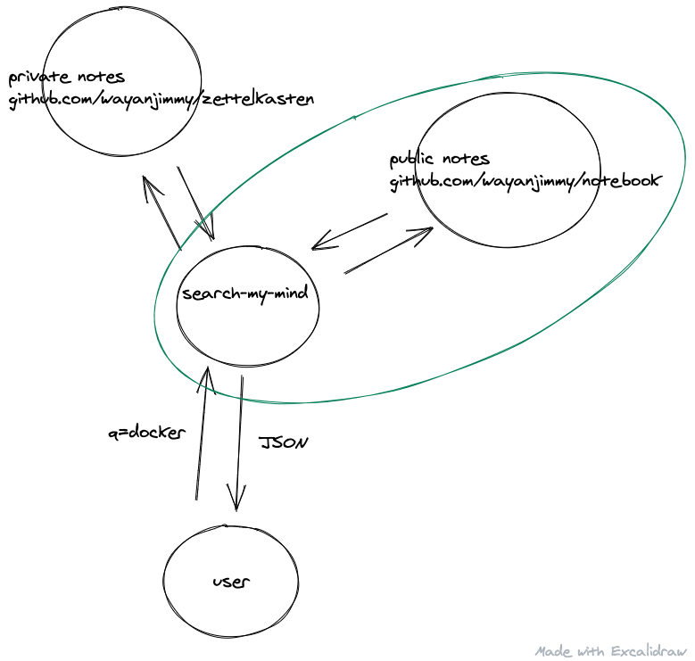

# Search My Mind

## Links

- [Excalidraw: How it works?](https://excalidraw.com/#json=4909532497051648,FJBi-SkB3I6XeNo0kCKLzA)
- [How I Navigate Hundreds of Tabs on Chrome with JXA and Alfred](https://medium.com/@bit2pixel/how-i-navigate-hundreds-of-tabs-on-chrome-with-jxa-and-alfred-9bbf971af02b)
